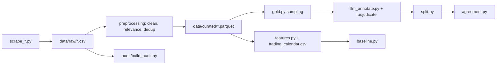

# Tunindex Sentiment Pipeline

Data collection and preprocessing for testing whether French and Arabic news sentiment improves next-session prediction of the Tunisian stock index (Tunindex, BVMT) beyond a price-only baseline.

The design follows the architecture blueprint (v1.1, September 2026), which adapts the FinBERT + ensemble ML + SHAP approach of Ibrahim, Khan & Kaplan (2025, *Borsa Istanbul Review* 25) to a bilingual, low-liquidity frontier market. The blueprint frames two hypotheses:

- **H1:** sentiment features add predictive power over lagged price, volume and macro controls under walk-forward validation.
- **H2:** the source ranking found for Turkiye (international outlets dominate) does not automatically transfer to Tunisia.

The audience is NLP and quantitative finance students and researchers working on frontier-market text. Only the data and preprocessing stages exist in this repo. No sentiment model, forecasting model or result is included yet, and none is claimed.

## Features

- Nine headline scrapers (French, Arabic and English outlets) plus a Tunindex OHLC scraper: `scrape_*.py`, `leconomistemaghrebin_Scraper.py`.
- Reproducible data audit of the raw headline CSVs, including a **wrong-country provenance check**: `audit/build_audit.py`, findings in [audit/AUDIT_REPORT.md](audit/AUDIT_REPORT.md).
- Preprocessing pipeline: cleaning and source windows, bilingual relevance filter, headline deduplication, funnel counts.
- Sentiment gold-set tooling: stratified sampling, local LLM pre-annotation, adjudication (single-annotator or majority vote), frozen train/validation/evaluation split.
- Inter-annotator agreement: Fleiss' kappa and weighted Cohen's kappa across any number of LLM annotators (`preprocessing/agreement.py`).
- Trading-calendar alignment and daily feature construction (`preprocessing/features.py`).
- Price-only walk-forward baseline, the pre-registered bar for H1 (`preprocessing/baseline.py`).
- Unit tests for normalisation, relevance, dedup, gold set, annotation and split logic.
- Data versioned with DVC.

## Tech stack

Python, pandas, NumPy, scikit-learn, SciPy, statsmodels, requests, lxml, curl_cffi, DuckDB, matplotlib, langdetect, fastText (`lid.176.ftz` model), pytest, DVC.

## Architecture



### Active sources

Eight of the ten scraped sources feed the pipeline, yielding **42,645 canonical relevant
headlines** (see `data/curated/funnel.csv`). Two are excluded, both recorded in the funnel with
`cleaned=0` rather than silently dropped:

| excluded source | reason |
|---|---|
| `economist_tunisia_economy` | 100%-overlapping subset of `economist_tunisia_all` (AUDIT_REPORT §4) |
| `assabah` | **wrong country** — `scrape_assabah.py` targets `assabah.ma` (Morocco), crime section, not Tunisia's `assabah.com.tn`. 11,860 Morocco mentions vs 27 Tunisia; 175 dirham vs 0 dinar. AUDIT_REPORT §6b |

Exclusion is a single key in `config.SOURCE_WINDOWS`. Raw files and scrapers are **retained**,
never deleted, so the audit stays reproducible.

Because `assabah` was the only Arabic source, the corpus is currently **French-dominant**
(~97% fr, plus en); the bilingual comparison in H2 is on hold until an Arabic outlet is
scraped. This is a known limitation, not a finding.

### Modelling status

Daily feature construction and the price-only walk-forward baseline **are**
implemented. The sentiment model itself is not: no classifier is trained, the
42,645-headline corpus is unscored, and neither H1 nor H2 has been tested.

**The pre-registered H1 bar.** Over 2,678 walk-forward predictions from 2014,
"always predict up" scores **0.5493**. The best price-only model reaches 0.5564
(McNemar p = 0.418 — not significant), and adding news *counts* makes it slightly
worse. This bar was fixed before any sentiment score existed. Details and the
supporting data characteristics are in [AUDIT_REPORT.md](audit/AUDIT_REPORT.md) section 8c.

Two constraints that follow from the data, both enforced in code:

- **Returns are close-to-close.** `open` is the previous session's close for 33%
  of rows, so `(close - open)/open` mixes two quantities (AUDIT_REPORT section 8b).
- **News dated day D may only predict sessions strictly after D.** Headlines have
  no time-of-day, so same-day mapping would leak.

**A sentiment classifier baseline exists** (`preprocessing/sentiment_baseline.py`,
TF-IDF + logistic): validation quadratic-weighted kappa **0.4715**, accuracy 0.6059
against a 0.5900 majority floor. Report QWK rather than accuracy — 59% of labels are
`positive`, which makes accuracy nearly blind. No transformer is fine-tuned yet; this
baseline exists so that a fine-tuned model can be judged against something.

### Two known threats to H1 validity

Both documented with evidence in [AUDIT_REPORT.md](audit/AUDIT_REPORT.md) section 8d.

1. **The annotation prompt does not define the task.** It specifies JSON formatting
   but never defines the labels, never says when `neutral` applies, and never anchors
   sentiment to market impact rather than tone. The labels track growth-flavoured
   vocabulary instead ("a draft environmental code" scores positive). Fix the prompt
   before re-annotating.
2. **Price-report headlines launder momentum into sentiment.** 10% of relevant
   headlines restate the index's own move; their direction words match that day's
   return with 84.3% accuracy, and read as a next-session feature they reach 0.5640
   directional accuracy — beating both the constant (0.5493) and the best price-only
   model (0.5564) with no news content. They are flagged, not dropped
   (`config.PRICE_REPORT_PATTERN`); H1 must be reported with them, without them, and
   on them alone as a placebo.

Still not implemented: language-routed sentiment scoring, the H1/H2 tests, SHAP.

## Prerequisites

- Python 3 <!-- TODO: minimum Python version -->
- Git and DVC
- Access to the DVC remote configured in [.dvc/config](.dvc/config) <!-- TODO: how collaborators obtain DagShub credentials -->
- Optional, for `llm_annotate.py`: a local LM Studio server on `localhost:1234` serving `qwen2.5-7b-instruct-1m`
- Optional, for the Tunindex Selenium fallback: Chrome

## Installation

```bash
git clone <repo-url>  # TODO: repository URL
cd ProjectNLP
python -m venv .venv && source .venv/bin/activate
pip install pandas pyarrow requests certifi lxml curl_cffi python-dateutil duckdb matplotlib langdetect pytest dvc
dvc pull
```

There is no `requirements.txt` or `pyproject.toml`. The package list above comes from the imports in the code. `pyarrow` is needed for the `.parquet` files, and `truststore` and `selenium` are optional.

`dvc pull` restores `data/` (tracked by [data.dvc](data.dvc)) and the fastText model tracked by [audit/models/lid.176.ftz.dvc](audit/models/lid.176.ftz.dvc).

## Configuration

No environment variables are read by the code. Settings live in files:

| Setting | Where | Default | Description |
|---|---|---|---|
| `SOURCE_WINDOWS` | [preprocessing/config.py](preprocessing/config.py) | per source | Date window kept for each source |
| `BOILERPLATE_TITLES` | preprocessing/config.py | per source | Rubric labels dropped as non-headlines |
| `FASTTEXT_CONFIDENCE_THRESHOLD` | preprocessing/config.py | `0.5` | Placeholder, not yet tuned |
| `ARABIZI_MIN_WORDS` | preprocessing/config.py | `2` | Words needed to flag a headline as Arabizi |
| Relevance keyword lists | preprocessing/config.py | first-pass | Not yet validated against hand labels |
| `--endpoint`, `--model` | `llm_annotate.py` flags | `http://localhost:1234/api/v1/chat`, `qwen2.5-7b-instruct-1m` | Local annotation server |

## Usage

Scrapers write their CSV to the current directory. Each is run as a script:

```bash
python scrape_tap.py
python scrape_tunindex.py
```

The preprocessing scripts read `data/raw/` and write `data/curated/`. Run them in order from the repo root:

```bash
python preprocessing/clean.py
python preprocessing/relevance.py
python preprocessing/dedup.py
python preprocessing/funnel.py
```

Build and annotate the sentiment gold set (defaults are set in each script):

```bash
python preprocessing/gold.py --target 3000
python preprocessing/llm_annotate.py                      # annotator 1
python preprocessing/llm_annotate.py --annotator 2 --model <other-model>
python preprocessing/agreement.py                         # Fleiss / Cohen kappa
python preprocessing/adjudicate_from_annotator.py --method majority
python preprocessing/split.py
```

Use models from **different families** for annotators 2+; a second model from the
same family measures its own consistency, not agreement. Majority ties are left
blank on purpose and `split.py` refuses the file until they are resolved.

Build daily features and run the price-only baseline:

```bash
python preprocessing/features.py --start 2014-01-01
python preprocessing/baseline.py            # price-only bar for H1
python preprocessing/sentiment_baseline.py  # TF-IDF bar for the sentiment model
```

Rebuild the audit outputs in `audit/`:

```bash
python audit/build_audit.py
```

## Project structure

```text
.
├── scrape_*.py                  # one scraper per source, plus Tunindex OHLC
├── leconomistemaghrebin_Scraper.py
├── preprocessing/               # cleaning, relevance, dedup, gold set, split,
│                                #   agreement, features, baseline, tests
├── audit/                       # raw-data audit script, report and CSV outputs
├── data/                        # DVC-tracked: raw/, curated/, per-ticker CSVs
├── data.dvc                     # DVC pointer for data/
├── .dvc/                        # DVC configuration
└── main.ipynb                   # scratch notebook
```

## Testing

```bash
python -m pytest preprocessing
```

56 tests, all passing.

## Contributing

<!-- TODO: contribution guidelines -->

## License

<!-- TODO: no LICENSE file in the repo; choose a license -->

## Author

<!-- TODO: author and contact -->
