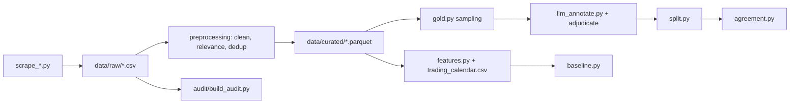

# Tunindex Sentiment Pipeline

Data collection, preprocessing and a pre-registered hypothesis harness for testing whether **French-language** news sentiment improves next-session prediction of the Tunisian stock index (Tunindex, BVMT) beyond a price-only baseline.

> **The corpus contains no Arabic.** The only Arabic source was Assabah, excluded once it was found to be the Moroccan paper (`assabah.ma`, crime section) rather than the Tunisian one. Relevant canonical rows: **41,597 fr / 1,048 en / 0 ar**. H2's bilingual framing is on hold until an Arabic outlet is scraped. Note also that `lang` is assigned per source, not detected per headline, so any "by language" figure is really a by-source-group figure.

The design follows the architecture blueprint (v1.1, September 2026), which adapts the FinBERT + ensemble ML + SHAP approach of Ibrahim, Khan & Kaplan (2025, *Borsa Istanbul Review* 25) to a bilingual, low-liquidity frontier market. The blueprint frames two hypotheses:

- **H1:** sentiment features add predictive power over lagged price, volume and macro controls under walk-forward validation.
- **H2:** the source ranking found for Turkiye (international outlets dominate) does not automatically transfer to Tunisia.

**H1 has been tested once on real sentiment scores, and the result is a null (NO-GO).** The scores come from a fine-tuned CamemBERT, with QWK 0.635 against a 150-row human anchor. The test ran under the pre-registration amendment [`PREREG_H1_AMENDMENT_A1.md`](audit/PREREG_H1_AMENDMENT_A1.md). Every sentiment arm's ΔAUC against the price-only F0 baseline is slightly negative (−0.003 to −0.006), and no confidence interval lies above zero. Diebold–Mariano finds the return forecast slightly *worse* with sentiment. Details are in [AUDIT_REPORT.md](audit/AUDIT_REPORT.md) §8j. H2 is untested: it needs an Arabic source.

The audience is NLP and quantitative finance students and researchers working on frontier-market text. The repo contains the data pipeline, the sentiment scorer (§8i), and the H1 harness with its result. It contains no trading model, and none is claimed.

## Features

- Nine headline scrapers (French, Arabic and English outlets) plus a Tunindex OHLC scraper: `scrape_*.py`, `leconomistemaghrebin_Scraper.py`.
- Reproducible data audit of the raw headline CSVs, including a **wrong-country provenance check**: `audit/build_audit.py`, findings in [audit/AUDIT_REPORT.md](audit/AUDIT_REPORT.md).
- Preprocessing pipeline: cleaning and source windows, relevance filter with country negation and listed-issuer matching, template-key near-duplicate deduplication, funnel counts.
- Sentiment gold-set tooling: stratified sampling, local LLM pre-annotation, adjudication (single-annotator or majority vote), frozen train/validation/evaluation split.
- Inter-annotator agreement: Fleiss' kappa and weighted Cohen's kappa across any number of LLM annotators (`preprocessing/agreement.py`). A 60-row cross-family pilot (qwen2.5-7b under v1 vs Claude under v2) gives quadratic Cohen **0.659** against nominal Fleiss 0.328 — see [AUDIT_REPORT.md](audit/AUDIT_REPORT.md) section 8f.
- Trading-calendar alignment and daily feature construction (`preprocessing/features.py`).
- Price-only walk-forward baseline, the pre-registered bar for H1 (`preprocessing/baseline.py`).
- Unit tests for normalisation, relevance, dedup, gold set, annotation and split logic.
- Data versioned with DVC.

## Tech stack

Python, pandas, NumPy, scikit-learn, SciPy, statsmodels, requests, lxml, curl_cffi, DuckDB, matplotlib, langdetect, fastText (`lid.176.ftz` model), pytest, DVC.

## Architecture



### Active sources

Eight of the ten scraped sources feed the pipeline, yielding **46,013 canonical
relevant headlines** from 47,784 relevant rows (see `data/curated/funnel.csv`). Two are excluded, both recorded in the funnel with
`cleaned=0` rather than silently dropped:

| excluded source | reason |
|---|---|
| `economist_tunisia_economy` | 100%-overlapping subset of `economist_tunisia_all` (AUDIT_REPORT §4) |
| `assabah` | **wrong country** — `scrape_assabah.py` targets `assabah.ma` (Morocco), crime section, not Tunisia's `assabah.com.tn`. 11,860 Morocco mentions vs 27 Tunisia; 175 dirham vs 0 dinar. AUDIT_REPORT §6b |

Exclusion is a single key in `config.SOURCE_WINDOWS`. Raw files and scrapers are **retained**,
never deleted, so the audit stays reproducible.

Because `assabah` was the only Arabic source, the corpus is currently **French-dominant**
(~97% fr, plus en); the bilingual comparison in H2 is on hold until an Arabic outlet is
scraped. This is a known limitation, not a finding.

### Modelling status

Daily feature construction, the price-only walk-forward baseline and the H1/H2
harness **are** implemented and run end to end. What is missing is a trustworthy
sentiment signal: the only classifier is a TF-IDF baseline trained on labels from a
single 7B annotator under a prompt that did not define the task, so **neither H1 nor
H2 has a reportable result**.

The corpus is scored leakage-free by `score_corpus.py --mode expanding`: 36,795 of
46,013 headlines carry a score, and the remaining 9,218 are left **unscored rather
than imputed** because no gold labels predate them.

**The H1 bar.** Per blueprint §6.2, **ROC-AUC is the primary metric and balanced
accuracy / MCC replace raw accuracy as the headline** — at a 54.9% base rate,
accuracy is nearly blind. Over 2,678 walk-forward predictions from 2014 with a
5-session embargo (§6.3), the price-only baseline reaches **AUC 0.594, balanced
accuracy 0.557, MCC 0.122**; raw accuracy is 0.574 against a 0.549 always-up
constant. Earlier revisions of this file reported raw accuracy as the headline,
which the blueprint forbids, and before that a lag-offset bug made the same number
0.5564. See [AUDIT_REPORT.md](audit/AUDIT_REPORT.md) sections 8c, 8e and 8g.

**The design is underpowered on the sign test.** MDE at 80% power is **3.06pp**;
published daily news-sentiment effects on index direction are 1-2pp. So a null from
the sign test alone is *inconclusive*. `hypothesis_tests.py` therefore also runs a
**Diebold-Mariano test on squared-error loss of returns** (Newey-West HAC), which
uses the magnitude the sign test discards and is far better powered.

**The momentum result is not robust to the test-window start.** `sensitivity.py`
grids `min_train` x `refit_every`: accuracy is stable (0.5712-0.5750) but the result
is significant in only 8 of 16 configurations, all at `min_train <= 500`, because a
later start raises the always-up constant from 0.5410 to 0.5579. Report the grid,
not the favourable cell.

Two constraints that follow from the data, both enforced in code:

- **Returns are close-to-close.** `open` is the previous session's close for 33%
  of rows, so `(close - open)/open` mixes two quantities (AUDIT_REPORT section 8b).
- **News dated day D may only predict sessions strictly after D.** Headlines have
  no time-of-day, so same-day mapping would leak.

**A sentiment classifier baseline exists** (`preprocessing/sentiment_baseline.py`,
TF-IDF + logistic): validation quadratic-weighted kappa **0.4715**, accuracy 0.6059
against a 0.5900 majority floor. Report QWK rather than accuracy — 59% of labels are
`positive`, which makes accuracy nearly blind. No transformer is fine-tuned yet; this
baseline exists so that a fine-tuned model can be judged against something.

### Two known threats to H1 validity

Both documented with evidence in [AUDIT_REPORT.md](audit/AUDIT_REPORT.md) section 8d.

1. **The annotation prompt did not define the task.** v1 specified JSON formatting but
   never defined the labels, never said when `neutral` applies, and never anchored
   sentiment to market impact rather than tone; its labels track growth-flavoured
   vocabulary instead ("a draft environmental code" scores positive), giving 58.8%
   positive and only 9.4% neutral. **Addressed:** `llm_annotate.py` now carries
   versioned prompts, and `PROMPT_V2` (the default) states the question as expected
   market impact, makes `neutral` the explicit default, defines each label by
   mechanism, names the observed traps and carries ten worked examples. `PROMPT_V1` is
   frozen so the original 3,000 labels stay attributable. **The existing 3,000 labels
   are still v1 — v1 and v2 labels are not comparable and must not be pooled.**
2. **Price-report headlines launder momentum into sentiment.** 10% of relevant
   headlines restate the index's own move; their direction words match that day's
   return with 84.3% accuracy, and read as a next-session feature they reach 0.5640
   directional accuracy — beating both the constant (0.5493) and the best price-only
   model (0.5564) with no news content. They are flagged, not dropped
   (`config.PRICE_REPORT_PATTERN`); H1 must be reported with them, without them, and
   on them alone as a placebo.

### Methodological controls

- **Four H1 arms**, not one: `all`, `ex_price` (price reports removed), `placebo`
  (price reports only), and `orthogonal` (sentiment residualised on `ret_lag0`,
  `ret_lag1`, `log_headlines_lag0`). The placebo is necessary but not sufficient —
  momentum also reaches the sentiment channel through sector commentary the regex
  never matches — which is what the orthogonalised arm covers.
- **Holm-Bonferroni** across the arms. `baseline.py`'s 8 configurations are
  exploratory and are labelled as such.
- **Leakage-free scoring.** `score_corpus.py --mode expanding` (the default) refits
  the classifier on gold rows dated strictly before each block. The old single-fit
  mode leaked 2026 labels into 2014 scores and is retained only as `--mode static`
  for quantifying the difference. Cost: ~20% of headlines have no prior labels and
  are left **unscored rather than imputed**.
- **Missing-day convention.** 59% of sessions have no price-report headline. Arms
  carry an explicit `has_sent_*` indicator alongside a 0-fill, so "no headlines" is
  distinguishable from "neutral headlines" and the paired test stays aligned.

### Blueprint conformance

Checked against the v1.1 architecture blueprint; full table in
[AUDIT_REPORT.md](audit/AUDIT_REPORT.md) section 8g. Fixed: the §6.2 metric set and
the §6.3 five-session embargo. On §5.2's F1 rung: the energy control was **tested rather than assumed**. Brent
daily spot (EIA, 97.5% session coverage) has no measurable relationship with
Tunindex — r = +0.020 ns against next-session returns, R² = 0.0004 versus 0.069 for
the last closed return. H1 is therefore reported against F0, with that deviation
documented and measured. EUR/TND and European index returns remain untested; the EU
demand channel is the more plausible of the two.

Also outstanding: F0 lacks day-of-week and volume change, F2 cannot split FR/AR
(no Arabic corpus), F3 is not its own rung, no block-bootstrap CIs, no purged
k-fold diagnostic, no separate COVID-2020 analysis.

**Update 2026-09-23 (amendment a1):**
- F0 now includes volume change and day of week.
- Block-bootstrap CIs, per-quarter stability, a COVID-2020 split and a purged k-fold diagnostic are in `h1_stats.py`.
- F1 was tested: Brent, EUR/TND and Euro Stoxx 50 each fail the declared entry rule (`macro_controls.py`).
- The sentiment model is fine-tuned CamemBERT.

Still not implemented: SHAP, and H2.

The harness is committed and tagged **`prereg-h1-v1`**, so the pre-registration claim
rests on git history rather than a file timestamp. One caveat stated plainly: the
default estimator (`kind="regress"`) was chosen *after* comparing it against
classification on the same data H1 is tested on, so that choice is outcome-selected
and is declared as such rather than presented as pre-specified.

## Prerequisites

- Python 3 <!-- TODO: minimum Python version -->
- Git and DVC
- Access to the DVC remote configured in [.dvc/config](.dvc/config) <!-- TODO: how collaborators obtain DagShub credentials -->
- Optional, for `llm_annotate.py`: a local LM Studio server on `localhost:1234` serving `qwen2.5-7b-instruct-1m`
- Optional, for the Tunindex Selenium fallback: Chrome

## Installation

```bash
git clone <repo-url>  # TODO: repository URL
cd ProjectNLP
python -m venv .venv && source .venv/bin/activate
pip install -r requirements.txt --extra-index-url https://download.pytorch.org/whl/cu128
dvc pull
```

`requirements.txt` pins the versions the pipeline last ran with. The extra index is for the CUDA 12.8 build of torch; on a CPU-only machine, drop the `+cu128` suffix in the file. `truststore` and `selenium` are optional.

`dvc pull` restores `data/` (tracked by [data.dvc](data.dvc)) and the fastText model tracked by [audit/models/lid.176.ftz.dvc](audit/models/lid.176.ftz.dvc).

## Configuration

No environment variables are read by the code. Settings live in files:

| Setting | Where | Default | Description |
|---|---|---|---|
| `SOURCE_WINDOWS` | [preprocessing/config.py](preprocessing/config.py) | per source | Date window kept for each source |
| `BOILERPLATE_TITLES` | preprocessing/config.py | per source | Rubric labels dropped as non-headlines |
| `FASTTEXT_CONFIDENCE_THRESHOLD` | preprocessing/config.py | `0.5` | Placeholder, not yet tuned |
| `ARABIZI_MIN_WORDS` | preprocessing/config.py | `2` | Words needed to flag a headline as Arabizi |
| Relevance keyword lists | preprocessing/config.py | first-pass | Not yet validated against hand labels |
| `--endpoint`, `--model` | `llm_annotate.py` flags | `http://localhost:1234/api/v1/chat`, `qwen2.5-7b-instruct-1m` | Local annotation server |
| `--annotator` | `llm_annotate.py` flag | `1` | Which `annotator_N_*` columns to write |
| `--prompt-version` | `llm_annotate.py` flag | `v2` | `v1` produced the original 3,000 labels and is frozen; `v2` defines the task |
| `PRICE_REPORT_PATTERN` | [preprocessing/config.py](preprocessing/config.py) | regex | Flags headlines that restate the index's own move (10% of the corpus) |

## Usage

Scrapers write their CSV to the current directory. Each is run as a script:

```bash
python scrape_tap.py
python scrape_tunindex.py
```

The preprocessing scripts read `data/raw/` and write `data/curated/`. Run them in order from the repo root:

```bash
python preprocessing/clean.py
python preprocessing/relevance.py
python preprocessing/dedup.py
python preprocessing/funnel.py
```

Build and annotate the sentiment gold set (defaults are set in each script):

```bash
python preprocessing/gold.py --target 3000
python preprocessing/llm_annotate.py                      # annotator 1
python preprocessing/llm_annotate.py --annotator 2 --model <other-model>  # prompt v2 by default
python preprocessing/agreement.py                         # Fleiss / Cohen kappa
python preprocessing/adjudicate_from_annotator.py --method majority
python preprocessing/split.py
```

Use models from **different families** for annotators 2+; a second model from the
same family measures its own consistency, not agreement. Majority ties are left
blank on purpose and `split.py` refuses the file until they are resolved.

Smoke-test a model on ~50 rows before committing to a full 3,000-row run — different
model families emit different JSON dialects, and the parser's fallback path is where
they break:

```bash
head -51 data/curated/sentiment_gold_annotation1.csv > /tmp/smoke.csv
python preprocessing/llm_annotate.py --input /tmp/smoke.csv --annotator 2 --prompt-version v2
```

Watch the **neutral share**: v1 produced 9.4%, which is implausibly low for financial
headlines. If v2 does not move it substantially upward, the limit is model capability
rather than prompt wording.

Build daily features and run the price-only baseline:

```bash
python preprocessing/score_corpus.py        # leakage-free expanding-window scoring
python preprocessing/features.py --start 2014-01-01
python preprocessing/baseline.py            # price-only bar for H1
python preprocessing/sentiment_baseline.py  # TF-IDF bar for the sentiment model
python preprocessing/hypothesis_tests.py    # H1: four arms, Holm-corrected, sign + DM tests
python preprocessing/sensitivity.py         # robustness to min_train / refit_every
```

Validate the relevance filter (the worksheet is generated; hand labels are not):

```bash
python preprocessing/relevance_validation.py worksheet -n 300
python preprocessing/relevance_validation.py report
```

Rebuild the audit outputs in `audit/`:

```bash
python audit/build_audit.py
```

## Project structure

```text
.
├── scrape_*.py                  # one scraper per source, plus Tunindex OHLC
├── leconomistemaghrebin_Scraper.py
├── preprocessing/               # cleaning, relevance, dedup, gold set, split,
│                                #   agreement, features, baseline, tests
├── audit/                       # raw-data audit script, report and CSV outputs
├── data/                        # DVC-tracked: raw/, curated/, per-ticker CSVs
├── data.dvc                     # DVC pointer for data/
├── .dvc/                        # DVC configuration
└── main.ipynb                   # scratch notebook
```

## Testing

```bash
python -m pytest preprocessing
```

117 tests, all passing.

## Contributing

<!-- TODO: contribution guidelines -->

## License

<!-- TODO: no LICENSE file in the repo; choose a license -->

## Author

<!-- TODO: author and contact -->
