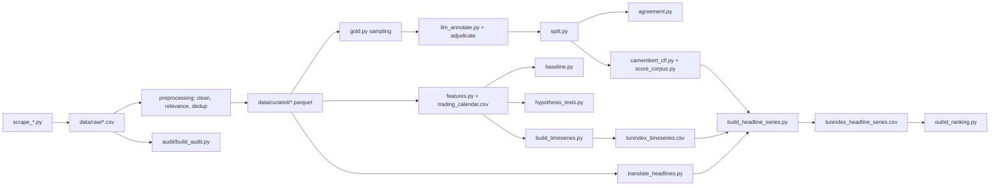

# Tunindex Sentiment Pipeline

Data collection, preprocessing and a pre-registered hypothesis harness for testing whether **French-language** news sentiment improves next-session prediction of the Tunisian stock index (Tunindex, BVMT) beyond a price-only baseline.

> **The corpus contains no Arabic.** The only Arabic source was Assabah, excluded once it was found to be the Moroccan paper (`assabah.ma`, crime section) rather than the Tunisian one. Relevant canonical rows: **44,977 fr / 1,036 en / 0 ar**. H2's bilingual framing is on hold until an Arabic outlet is scraped. Note also that `lang` is assigned per source, not detected per headline, so any "by language" figure is really a by-source-group figure.

The design follows the architecture blueprint (v1.1, September 2026), which adapts the FinBERT + ensemble ML + SHAP approach of Ibrahim, Khan & Kaplan (2025, *Borsa Istanbul Review* 25) to a bilingual, low-liquidity frontier market. The blueprint frames two hypotheses:

- **H1:** sentiment features add predictive power over lagged price, volume and macro controls under walk-forward validation.
- **H2:** the source ranking found for Turkiye (international outlets dominate) does not automatically transfer to Tunisia.

**H1 has a verdict: REJECTED.** Every sentiment arm scores below the price-only baseline
(ROC-AUC 0.6074), and a Diebold-Mariano test on returns finds the degradation significant in
3 of 4 arms. That is not evidence that news sentiment cannot predict Tunindex — it is
evidence that these daily aggregates add nothing to the price lags. The sign test remains
**underpowered** (MDE 3.2pp against published effects of 1-2pp), so a null from it alone is
*inconclusive*; both tests are reported. One caveat found afterwards: the yearly
CamemBERT models for 2016–18 were trained on too few labels to work, and ~28% of H1's
predictions fall in those years, so **sentiment is only usable from 2019** and H1 is due
a rerun on that window.

**H2 has a first per-outlet run** (2019+): no outlet's sentiment adds to the price-only
model out of sample, kapitalis makes it worse, and the English outlets cannot be tested
because CamemBERT scores almost every English headline neutral. **Inconclusive.**

One defect still outranks every result here: **artifacts in `data/curated/` with no
producing script.** The CamemBERT fine-tune and the translation step were closed on
2026-09-30; the v2 gold-set construction, XLM-R, the FinBERT head and the macro
controls are still off-repository. See [architecture.md](architecture.md) §7 and
[AUDIT_REPORT.md](audit/AUDIT_REPORT.md) §8i.

The audience is NLP and quantitative finance students and researchers working on frontier-market text.

## Features

- Nine headline scrapers (French, Arabic and English outlets) plus a Tunindex OHLC scraper: `scrape_*.py`, `leconomistemaghrebin_Scraper.py`.
- Reproducible data audit of the raw headline CSVs, including a **wrong-country provenance check**: `audit/build_audit.py`, findings in [audit/AUDIT_REPORT.md](audit/AUDIT_REPORT.md).
- Preprocessing pipeline: cleaning and source windows, relevance filter with country negation and listed-issuer matching, template-key near-duplicate deduplication, funnel counts.
- Sentiment gold-set tooling: stratified sampling, local LLM pre-annotation, adjudication (single-annotator or majority vote), frozen train/validation/evaluation split.
- Inter-annotator agreement: Fleiss' kappa and weighted Cohen's kappa across any number of annotators (`preprocessing/agreement.py`). The v2 gold set carries three — qwen2.5-7b, ministral-8b and **150 human-labelled rows** — with quadratic Cohen **0.689** between qwen and the human. See [AUDIT_REPORT.md](audit/AUDIT_REPORT.md) section 8h.
- Analysis time series: `preprocessing/build_timeseries.py` emits one tidy CSV, 3,179 sessions x 65 columns, price + counts + sentiment + macro ([architecture.md](architecture.md) section 8).
- Sentiment instrument: fine-tuned CamemBERT, reproducible from the repo (`preprocessing/camembert_clf.py`), plugged into leakage-free yearly scoring (`score_corpus.py --model camembert`); a saved copy in `data/models/camembert_3class/` for scoring new headlines.
- Local, incremental French→English translation of every headline (`preprocessing/translate_headlines.py`, opus-mt-fr-en at a pinned revision; no API key).
- Per-headline series: `preprocessing/build_headline_series.py` emits one row per headline — English text, outlet, CamemBERT label, Tunindex values — 45,706 rows ([architecture.md](architecture.md) section 8b).
- Per-outlet H2 analysis (`preprocessing/outlet_ranking.py`): add-one, leave-one-out and weights per outlet, with and without price reports, linear and gradient boosting.
- Time-series EDA notebook, executed with outputs stored (`TsEDA.ipynb`).
- Trading-calendar alignment and daily feature construction (`preprocessing/features.py`).
- Price-only walk-forward baseline, the pre-registered bar for H1 (`preprocessing/baseline.py`).
- Unit tests for normalisation, relevance, dedup, gold set, annotation and split logic.
- Data versioned with DVC.

## Tech stack

Python, pandas, NumPy, scikit-learn, SciPy, statsmodels, PyTorch, Hugging Face Transformers (CamemBERT, MarianMT), sentencepiece, requests, lxml, curl_cffi, DuckDB, matplotlib, seaborn, langdetect, fastText (`lid.176.ftz` model), pytest, DVC.

## Architecture


```mermaid
flowchart LR
    A[scrape_*.py] --> B[data/raw/*.csv]
    B --> C[preprocessing: clean, relevance, dedup]
    C --> D[data/curated/*.parquet]
    D --> E[gold.py sampling]
    E --> F[llm_annotate.py + adjudicate]
    F --> G[split.py]
    B --> H[audit/build_audit.py]
    G --> I[agreement.py]
    D --> J[features.py + trading_calendar.csv]
    J --> K[baseline.py]
    J --> L[hypothesis_tests.py]
    J --> M[build_timeseries.py]
    M --> N[tunindex_timeseries.csv]
    G --> O[camembert_clf.py + score_corpus.py]
    D --> P[translate_headlines.py]
    O --> Q[build_headline_series.py]
    P --> Q
    N --> Q
    Q --> R[tunindex_headline_series.csv]
    R --> S[outlet_ranking.py]
```

### Active sources

Eight of the ten scraped sources feed the pipeline, yielding **46,013 canonical
relevant headlines** from 47,784 relevant rows (see `data/curated/funnel.csv`). Two are excluded, both recorded in the funnel with
`cleaned=0` rather than silently dropped:

| excluded source | reason |
|---|---|
| `economist_tunisia_economy` | 100%-overlapping subset of `economist_tunisia_all` (AUDIT_REPORT §4) |
| `assabah` | **wrong country** — `scrape_assabah.py` targets `assabah.ma` (Morocco), crime section, not Tunisia's `assabah.com.tn`. 11,860 Morocco mentions vs 27 Tunisia; 175 dirham vs 0 dinar. AUDIT_REPORT §6b |

Exclusion is a single key in `config.SOURCE_WINDOWS`. Raw files and scrapers are **retained**,
never deleted, so the audit stays reproducible.

Because `assabah` was the only Arabic source, the corpus is currently **French-dominant**
(~97% fr, plus en); the bilingual comparison in H2 is on hold until an Arabic outlet is
scraped. This is a known limitation, not a finding.

### Modelling status

Daily feature construction, the price-only walk-forward baseline, the H1 harness and a
per-outlet H2 analysis are implemented and run end to end, on CamemBERT scores trained
on the v2 gold set (two LLM annotators plus 150 human rows).

The corpus is scored leakage-free by `score_corpus.py --model camembert --mode
expanding`: **39,692 of 46,013** headlines carry a score, and the remaining **6,321** are
left **unscored rather than imputed** because no gold labels predate them. **Scores
before 2019 are not a measurement:** the 2016 model saw 298 labels and calls everything
neutral, and 2017–18 never predict negative. See
[AUDIT_REPORT.md](audit/AUDIT_REPORT.md) §8i.2.

**The H1 bar.** Per blueprint §6.2, **ROC-AUC is the primary metric and balanced
accuracy / MCC replace raw accuracy as the headline** — at a 54.9% base rate,
accuracy is nearly blind. Over 2,678 walk-forward predictions from 2014 with a
5-session embargo (§6.3), the price-only baseline reaches **AUC 0.6074, balanced
accuracy 0.5675, MCC 0.141**; raw accuracy is 0.582 against a 0.549 always-up
constant. Day-of-week and volume-change features were added in the 2026-09-28 run,
closing two of the §6.2 gaps. Earlier revisions of this file reported raw accuracy as the headline,
which the blueprint forbids, and before that a lag-offset bug made the same number
0.5564. See [AUDIT_REPORT.md](audit/AUDIT_REPORT.md) sections 8c, 8e and 8g.

**The design is underpowered on the sign test.** MDE at 80% power is **3.2pp**;
published daily news-sentiment effects on index direction are 1-2pp. So a null from
the sign test alone is *inconclusive*. `hypothesis_tests.py` therefore also runs a
**Diebold-Mariano test on squared-error loss of returns** (Newey-West HAC), which
uses the magnitude the sign test discards and is far better powered.

**The momentum result is not robust to the test-window start.** `sensitivity.py`
grids `min_train` x `refit_every`: accuracy is stable (0.5712-0.5750) but the result
is significant in only 8 of 16 configurations, all at `min_train <= 500`, because a
later start raises the always-up constant from 0.5410 to 0.5579. Report the grid,
not the favourable cell.

Two constraints that follow from the data, both enforced in code:

- **Returns are close-to-close.** `open` is the previous session's close for 33%
  of rows, so `(close - open)/open` mixes two quantities (AUDIT_REPORT section 8b).
- **News dated day D may only predict sessions strictly after D.** Headlines have
  no time-of-day, so same-day mapping would leak.

**The sentiment instrument is a fine-tuned CamemBERT.** On the v2 gold set (3-class,
n=441 validation) it reaches quadratic-weighted kappa **0.708** against TF-IDF's 0.561,
XLM-R's 0.589 and FinBERT-on-raw-French's **0.021** — a finance-domain English encoder
reads French headlines as noise until they are translated. On the 150-row **human**
evaluation split CamemBERT reaches QWK 0.635 (accuracy 0.660 vs a 0.567 floor). Report
QWK rather than accuracy: 53% of labels are `neutral`.

This settles a question the TF-IDF baseline was built to ask — if a transformer had only
matched it, the ceiling would have been label quality and no GPU would fix it. It clears
it by 0.147 QWK, so the ceiling was model capacity. Full table in
[AUDIT_REPORT.md](audit/AUDIT_REPORT.md) section 8h. The fine-tuning was done
off-repository; `preprocessing/camembert_clf.py` now reproduces it (human-eval QWK
**0.618** against the original 0.635, within seed noise — §8i.1). CamemBERT cannot read
English: it scores almost every Guardian, NYT and Economist headline neutral.

### Two known threats to H1 validity

Both documented with evidence in [AUDIT_REPORT.md](audit/AUDIT_REPORT.md) section 8d.

1. **The annotation prompt did not define the task.** v1 specified JSON formatting but
   never defined the labels, never said when `neutral` applies, and never anchored
   sentiment to market impact rather than tone; its labels track growth-flavoured
   vocabulary instead ("a draft environmental code" scores positive), giving 58.8%
   positive and only 9.4% neutral. **Addressed:** `llm_annotate.py` now carries
   versioned prompts, and `PROMPT_V2` (the default) states the question as expected
   market impact, makes `neutral` the explicit default, defines each label by
   mechanism, names the observed traps and carries ten worked examples. `PROMPT_V1` is
   frozen so the original 3,000 labels stay attributable. **The existing 3,000 labels
   are still v1 — v1 and v2 labels are not comparable and must not be pooled.**
2. **Price-report headlines launder momentum into sentiment.** **3.74%** of canonical
   headlines restate the index's own move (1,722 of 46,013; the 10% figure quoted
   elsewhere in this repo is a stale v1-regex number on a smaller corpus); their direction words match that day's
   return with 84.3% accuracy, and read as a next-session feature they reach 0.5640
   directional accuracy — beating both the constant (0.5493) and the best price-only
   model (0.5564) with no news content. They are flagged, not dropped
   (`config.PRICE_REPORT_PATTERN`); H1 must be reported with them, without them, and
   on them alone as a placebo.

### Methodological controls

- **Four H1 arms**, not one: `all`, `ex_price` (price reports removed), `placebo`
  (price reports only), and `orthogonal` (sentiment residualised on `ret_lag0`,
  `ret_lag1`, `log_headlines_lag0`). The placebo is necessary but not sufficient —
  momentum also reaches the sentiment channel through sector commentary the regex
  never matches — which is what the orthogonalised arm covers.
- **Holm-Bonferroni** across the arms. `baseline.py`'s 8 configurations are
  exploratory and are labelled as such.
- **Leakage-free scoring.** `score_corpus.py --mode expanding` (the default) refits
  the classifier on gold rows dated strictly before each block. The old single-fit
  mode leaked 2026 labels into 2014 scores and is retained only as `--mode static`
  for quantifying the difference. Cost: ~20% of headlines have no prior labels and
  are left **unscored rather than imputed**.
- **Missing-day convention.** 59% of sessions have no price-report headline. Arms
  carry an explicit `has_sent_*` indicator alongside a 0-fill, so "no headlines" is
  distinguishable from "neutral headlines" and the paired test stays aligned.

### Blueprint conformance

Checked against the v1.1 architecture blueprint; full table in
[AUDIT_REPORT.md](audit/AUDIT_REPORT.md) section 8g. Fixed: the §6.2 metric set and
the §6.3 five-session embargo. On §5.2's F1 rung: the energy control was **tested rather than assumed**. Brent
daily spot (EIA, 97.5% session coverage) has no measurable relationship with
Tunindex — r = +0.020 ns against next-session returns, R² = 0.0004 versus 0.069 for
the last closed return. H1 is therefore reported against F0, with that deviation
documented and measured. EUR/TND and European index returns remain untested; the EU
demand channel is the more plausible of the two.

**Closed since:** F0 now carries day-of-week and volume change; block-bootstrap ΔAUC
CIs are computed (2,000 resamples, block 20); EUR/TND and EuroStoxx 50 were tested
alongside Brent and **all three were declined on evidence** — none reaches p < 0.05
against next-session returns, and the strongest is 18x weaker than `ret_lag0`.

Still outstanding: F2 cannot split FR/AR (no Arabic corpus), F3 is not its own rung, no
purged k-fold diagnostic, no separate COVID-2020 analysis, and SHAP is not implemented.

The harness is committed and tagged **`prereg-h1-v1`**, so the pre-registration claim
rests on git history rather than a file timestamp. One caveat stated plainly: the
default estimator (`kind="regress"`) was chosen *after* comparing it against
classification on the same data H1 is tested on, so that choice is outcome-selected
and is declared as such rather than presented as pre-specified.

## Prerequisites

- Python 3 <!-- TODO: minimum Python version -->
- Git and DVC
- Access to the DVC remote configured in [.dvc/config](.dvc/config) <!-- TODO: how collaborators obtain DagShub credentials -->
- Optional, for `llm_annotate.py`: a local LM Studio server on `localhost:1234` serving `qwen2.5-7b-instruct-1m`
- Optional, for the Tunindex Selenium fallback: Chrome

## Installation

```bash
git clone <repo-url>  # TODO: repository URL
cd ProjectNLP
python3 -m venv .venv && source .venv/bin/activate
pip install pandas pyarrow numpy scikit-learn scipy statsmodels requests certifi lxml curl_cffi python-dateutil duckdb matplotlib seaborn langdetect pytest dvc
pip install torch "transformers>=4.44,<5" sentencepiece   # CamemBERT + translation; a CUDA GPU is strongly advised
dvc pull
```

There is no `requirements.txt` or `pyproject.toml`. The package list above comes from the imports in the code. `pyarrow` is needed for the `.parquet` files, and `truststore` and `selenium` are optional.

`dvc pull` restores `data/` (tracked by [data.dvc](data.dvc)) and the fastText model tracked by [audit/models/lid.176.ftz.dvc](audit/models/lid.176.ftz.dvc).

## Configuration

No environment variables are read by the code. Settings live in files:

| Setting | Where | Default | Description |
|---|---|---|---|
| `SOURCE_WINDOWS` | [preprocessing/config.py](preprocessing/config.py) | per source | Date window kept for each source |
| `BOILERPLATE_TITLES` | preprocessing/config.py | per source | Rubric labels dropped as non-headlines |
| `FASTTEXT_CONFIDENCE_THRESHOLD` | preprocessing/config.py | `0.5` | Placeholder, not yet tuned |
| `ARABIZI_MIN_WORDS` | preprocessing/config.py | `2` | Words needed to flag a headline as Arabizi |
| Relevance keyword lists | preprocessing/config.py | first-pass | Not yet validated against hand labels |
| `--endpoint`, `--model` | `llm_annotate.py` flags | `http://localhost:1234/api/v1/chat`, `qwen2.5-7b-instruct-1m` | Local annotation server |
| `--annotator` | `llm_annotate.py` flag | `1` | Which `annotator_N_*` columns to write |
| `--prompt-version` | `llm_annotate.py` flag | `v2` | `v1` produced the original 3,000 labels and is frozen; `v2` defines the task |
| `PRICE_REPORT_PATTERN` | [preprocessing/config.py](preprocessing/config.py) | regex | Flags headlines that restate the index's own move (3.74% of canonical rows) |
| `--model` | `score_corpus.py` flag | `tfidf` | `camembert` fine-tunes one CamemBERT per yearly block (GPU, ~3 h) |
| `--fill-before` | `build_headline_series.py` flag | `2019-01-01` | Rows scored by an older yearly model take the saved model's label, tagged `sent_source = saved_model`; `none` disables |
| `MODELS` | [preprocessing/translate_headlines.py](preprocessing/translate_headlines.py) | `fr` → opus-mt-fr-en @ `c4aed37b` | One translator per source language; an unlisted language stops the run |

## Usage

Scrapers write their CSV to the current directory. Each is run as a script:

```bash
python3 scrape_tap.py
python3 scrape_tunindex.py
```

The preprocessing scripts read `data/raw/` and write `data/curated/`. Run them in order from the repo root:

```bash
python3 preprocessing/clean.py
python3 preprocessing/relevance.py
python3 preprocessing/dedup.py
python3 preprocessing/funnel.py
```

Build and annotate the sentiment gold set (defaults are set in each script):

```bash
python3 preprocessing/gold.py --target 3000
python3 preprocessing/llm_annotate.py                      # annotator 1
python3 preprocessing/llm_annotate.py --annotator 2 --model <other-model>  # prompt v2 by default
python3 preprocessing/agreement.py                         # Fleiss / Cohen kappa
python3 preprocessing/adjudicate_from_annotator.py --method majority
python3 preprocessing/split.py
```

Use models from **different families** for annotators 2+; a second model from the
same family measures its own consistency, not agreement. Majority ties are left
blank on purpose and `split.py` refuses the file until they are resolved.

Smoke-test a model on ~50 rows before committing to a full 3,000-row run — different
model families emit different JSON dialects, and the parser's fallback path is where
they break:

```bash
head -51 data/curated/sentiment_gold_annotation1.csv > /tmp/smoke.csv
python3 preprocessing/llm_annotate.py --input /tmp/smoke.csv --annotator 2 --prompt-version v2
```

Watch the **neutral share**: v1 produced 9.4%, which is implausibly low for financial
headlines. If v2 does not move it substantially upward, the limit is model capability
rather than prompt wording.

Build daily features and run the price-only baseline:

```bash
python3 preprocessing/score_corpus.py        # leakage-free expanding-window scoring
python3 preprocessing/features.py --start 2014-01-01
python3 preprocessing/baseline.py            # price-only bar for H1
python3 preprocessing/sentiment_baseline.py  # TF-IDF bar for the sentiment model
python3 preprocessing/hypothesis_tests.py    # H1: four arms, Holm-corrected, sign + DM tests
python3 preprocessing/sensitivity.py         # robustness to min_train / refit_every
```

**`features.py` defaults to the v1 scored file.** `DEFAULT_SCORED` is
`04_scored.parquet`, whose own metadata calls it "NOT a sentiment measurement". The
committed `daily_features.parquet` was built with the CamemBERT scores, so pass them
explicitly:

```bash
python3 preprocessing/features.py --start 2014-01-01 \
        --scored data/curated/04_scored_v2_camembert.parquet
```

Reproduce the sentiment instrument, translate, and build the per-headline series
(GPU; the first two are one-off):

```bash
python3 preprocessing/camembert_clf.py                    # train split -> 150 human rows (QWK ~0.62)
python3 preprocessing/camembert_clf.py --save data/models/camembert_3class
python3 preprocessing/score_corpus.py --model camembert \
        --gold data/curated/sentiment_gold_v2_full.csv \
        --split data/curated/sentiment_gold_v2_full_split.csv \
        --output data/curated/04_scored_v2_camembert_repro.parquet \
        --metadata data/curated/04_scored_v2_camembert_repro_metadata.json
python3 preprocessing/camembert_clf.py --score-corpus     # saved-model fill, descriptive only
python3 preprocessing/translate_headlines.py              # incremental; --check-gold to verify
python3 preprocessing/build_headline_series.py            # -> tunindex_headline_series.csv
python3 preprocessing/outlet_ranking.py                   # per-outlet H2, 2019+
```

Anything that claims prediction must filter `sent_source == "yearly_refit"`.

Build the single tidy analysis CSV — one row per trading session, price + counts +
sentiment + macro, 3,179 x 65:

```bash
python3 preprocessing/build_timeseries.py   # -> data/curated/tunindex_timeseries.csv
```

It asserts on every run that the five columns it recomputes reproduce the committed
artifact exactly. Column-by-column dictionary in
[architecture.md](architecture.md) section 8.

Validate the relevance filter (the worksheet is generated; hand labels are not):

```bash
python3 preprocessing/relevance_validation.py worksheet -n 300
python3 preprocessing/relevance_validation.py report
```

Rebuild the audit outputs in `audit/`:

```bash
python3 audit/build_audit.py
```

## Project structure

```text
.
├── PRD.md                       # hypotheses, success criteria, scope, milestones
├── architecture.md              # full pipeline reference + data dictionary
├── architecture-essentials.md   # the nine rules that break the science if violated
├── AGENTS.md                    # working rules for any coding agent
├── CLAUDE.md                    # Claude Code entry point
├── TsEDA.ipynb                  # time-series EDA of the analysis frame
├── scrape_*.py                  # one scraper per source, plus Tunindex OHLC
├── leconomistemaghrebin_Scraper.py   # scrapes TWO outlets: leconomistmaghrebin + lapresse
├── preprocessing/               # cleaning, relevance, dedup, gold set, split,
│                                #   agreement, features, baseline, timeseries, tests
├── audit/                       # raw-data audit script, report and CSV outputs
├── data/                        # DVC-tracked: raw/, curated/, models/ (saved CamemBERT)
├── data.dvc                     # DVC pointer for data/
└── .dvc/                        # DVC configuration
```

**Read [architecture-essentials.md](architecture-essentials.md) before touching
`preprocessing/` or `audit/`.** Ninety lines, every one load-bearing.

## Testing

```bash
python3 -m pytest preprocessing
```

117 tests, all passing. Use `python3` — plain `python` is not on PATH in the
development environment.

## Contributing

<!-- TODO: contribution guidelines -->

## License

<!-- TODO: no LICENSE file in the repo; choose a license -->

## Author

<!-- TODO: author and contact -->
