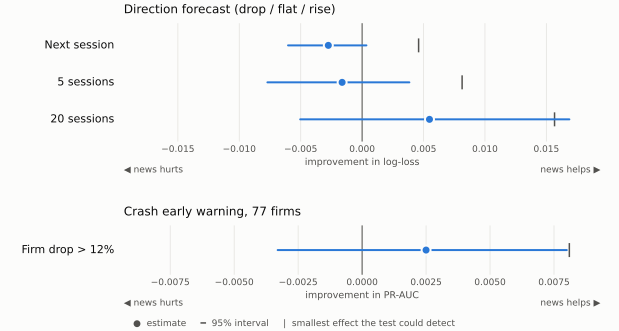

<h1 align="center">Tunindex News Sentiment</h1>

<p align="center">
  <em>Does the morning paper move the Tunis Stock Exchange? We read 46,000 headlines to find out.</em>
</p>

<p align="center">
  
  
  
  
  
</p>

<p align="center">
  <strong>46,013 headlines &middot; 8 outlets &middot; 2016&ndash;2026 &middot; 3 pre-registered tests &middot; 0 of them won by the news</strong><br>
  <sub>Sentiment from a fine-tuned CamemBERT (agreement with human labels: quadratic &kappa; 0.680), tested out of sample against a price-only model on the same trading sessions.</sub>
</p>

---

In 2025, a study of Borsa Istanbul found that news sentiment helps predict the Turkish
market, and that international outlets matter more than local ones. Turkey is a liquid
emerging market. Tunisia is a frontier market: trading is thin, volume comes in sudden
block trades, and almost the entire financial press writes in French.

This project rebuilds that study for the Tunis Stock Exchange (BVMT) and its index,
Tunindex. It scrapes the Tunisian financial press, trains a French sentiment model on
labelled headlines, and asks a simple question: once you already know recent prices,
does the news tell you anything more?

## The answer

Not in a way we can measure. Adding news to a price-only model never improved a
forecast, at any horizon.

<p align="center">
  <picture>
    <source media="(prefers-color-scheme: dark)" srcset="docs/assets/h3_effects_dark.svg">
    
  </picture>
</p>

Each dot is the change in forecast quality when news is added, and the line is its 95%
interval. Every interval crosses zero, and every estimate falls short of the smallest
effect the test could detect (the grey tick). The next-session forecast leans the wrong
way: news makes it slightly worse, which matches what the earlier tests found.

What does work is price history. A model that only sees past prices flags firm-level
drops of more than 12% at 2.2 times the base rate, about 15 trading days ahead.

## Turkey vs Tunisia

| | Borsa Istanbul (Ibrahim, Khan & Kaplan, 2025) | Tunis Stock Exchange (this project) |
|---|---|---|
| Market | liquid emerging market | thin frontier market, return autocorrelation +0.26 |
| News | domestic and international outlets | about 46,000 headlines, 98% French |
| Sentiment model | FinBERT (English finance) | CamemBERT fine-tuned on French market headlines |
| Does sentiment help? | yes | no measurable gain (H1, H3) |
| Do international outlets matter more? | yes | could not be tested: too few English headlines, and the French model reads English as neutral (H2) |

## Three questions

<details>
<summary><strong>H1. Does daily sentiment improve next-day up/down prediction?</strong> Rejected.</summary>

<br>

The price-only baseline reaches ROC-AUC 0.607. Every sentiment variant scores below it,
and a Diebold-Mariano test finds the loss significant in 3 of 4 variants. The variants
include one built only from "Tunindex closed up 0.3%"-style headlines, because those
restate the market's own move and would make momentum look like news.
Evidence: [AUDIT_REPORT §8h.7](audit/AUDIT_REPORT.md).

</details>

<details>
<summary><strong>H2. Does the Turkish source ranking carry over?</strong> Inconclusive.</summary>

<br>

Tested outlet by outlet from 2019. None of the French outlets adds anything out of
sample, and Kapitalis makes the forecast worse (Holm-adjusted p = 0.036). The Guardian,
the New York Times and The Economist could not be tested: together they contribute about
1,000 headlines, and the French model scores almost all of them neutral.
Evidence: [AUDIT_REPORT §8i.6](audit/AUDIT_REPORT.md).

</details>

<details>
<summary><strong>H3. Does news help a drop / flat / rise forecast, or warn of crashes?</strong> Inconclusive at every horizon.</summary>

<br>

Pre-registered in [audit/PREREG_H3.md](audit/PREREG_H3.md) (git tag `prereg-h3-v1`) before
any model was fitted.

| Test | Price only | + news | Change [95% CI] | Smallest detectable |
|---|---|---|---|---|
| Next session, log-loss | 1.0790 | 1.0818 | +0.0028 [−0.0003, +0.0060] | 0.0046 |
| 5 sessions, log-loss | | | +0.0016 [−0.004, +0.008] | 0.008 |
| 20 sessions, log-loss | | | −0.0055 [−0.017, +0.005] | 0.016 |
| Firm drop > 12%, PR-AUC | 0.179 | 0.182 | +0.0025 [−0.003, +0.008] | 0.008 |

Lower log-loss is better; higher PR-AUC is better. Evidence: [AUDIT_REPORT §H3](audit/AUDIT_REPORT.md).

</details>

## How it works

```
scrapers/        8 outlets + Tunindex prices            →  data/raw/
preprocessing/   clean, relevance filter, dedup         →  46,013 headlines
                 gold labels (2 LLMs, 1 human, Haiku)   →  4,730 labelled headlines
                 CamemBERT, refit each year on the past →  daily sentiment, 2016+
                 walk-forward vs price-only model       →  H1, H2, H3
audit/           every decision, with the numbers behind it
```

A few rules hold everywhere, because breaking any of them produces a result that looks
fine and is wrong:

- News dated on day D only predicts sessions after D. Headlines carry no time of day, so
  a same-day mapping would leak.
- Each year's sentiment comes from a model trained only on earlier labels.
- Returns are close-to-close. In a third of rows the index file's `open` column repeats
  the previous close.
- The 150 human-labelled headlines are used for grading only, never for training.
- Every test compares the two models on identical sessions, with block-bootstrap
  intervals and a Holm correction.

<details>
<summary><strong>Data</strong></summary>

<br>

| Source | Language | Headlines |
|---|---|---|
| ilboursa, Kapitalis, L'Economiste Maghrébin, La Presse, TAP | French | 44,977 |
| The Guardian, New York Times, The Economist | English | 1,036 |
| Tunindex daily prices, 2010–2026 | | 4,167 sessions |
| Per-stock prices, 88 listed firms, 2010–2022 | | 187,987 rows |

Two problems were found and fixed along the way. The scraped "Assabah" turned out to be
the Moroccan newspaper rather than the Tunisian one; a geography check caught it and it
was excluded, which leaves the corpus with no Arabic. And 19 "sessions" in the index file
are copies of the previous day (mostly public holidays), so they are dropped.

The data is versioned with DVC on DagsHub and is not stored in git.

</details>

<details>
<summary><strong>The sentiment labels</strong></summary>

<br>

Each headline is labelled for its expected effect on Tunisian listed shares, which is a
different question from whether its tone sounds positive.

- 2,930 headlines labelled by two local models (qwen2.5-7b and ministral-8b) and adjudicated.
- 150 labelled by a person. These are the only ground truth and are never trained on.
- 1,800 headlines from 2014–2018 labelled by Claude Haiku, so that the early yearly models
  have enough data. Haiku was first graded on the 150 human labels and agreed with them
  more closely than either local model (quadratic κ 0.756 against 0.676). It saw neither
  the date nor the outlet.

</details>

## Run it

```bash
python3 -m venv .venv && source .venv/bin/activate
pip install -r requirements.txt
dvc pull                          # data from DagsHub
python3 -m pytest preprocessing   # 121 tests
python3 preprocessing/h3.py       # the H3 analysis, about 4 minutes on a CPU
```

<details>
<summary><strong>Full pipeline</strong></summary>

<br>

```bash
# corpus
python3 preprocessing/clean.py && python3 preprocessing/relevance.py && python3 preprocessing/dedup.py

# sentiment model (GPU; on Colab use colab/h3_camembert_v3.ipynb, which resumes after a disconnect)
python3 preprocessing/camembert_clf.py --gold data/curated/sentiment_gold_v3.csv \
    --split data/curated/sentiment_gold_v3_split.csv --out data/curated/finetune/eval.json
python3 preprocessing/score_corpus.py --model camembert --min-train 700 \
    --gold data/curated/sentiment_gold_v3.csv --split data/curated/sentiment_gold_v3_split.csv \
    --output data/curated/04_scored_v3_camembert.parquet \
    --metadata data/curated/04_scored_v3_camembert_metadata.json

# hypotheses
python3 preprocessing/hypothesis_tests.py   # H1
python3 preprocessing/outlet_ranking.py     # H2
python3 preprocessing/h3.py                 # H3

# audit and figures
python3 audit/build_audit.py
python3 docs/make_figures.py
```

</details>

## Status

- **ADR-001** (the pre-registered plan, P0 to P6): **executed, exited at G3.** Index news
  flow (P1) and headline content (P3) add nothing. Firm news days are followed by a bigger
  next move (P2), and that comes from news published after the close (P2t). P4 to P6 did
  not run. Every result in one table:
  [Summary of ADR-001 results](audit/AUDIT_REPORT.md#summary-of-adr-001-results), then
  [§P2t](audit/AUDIT_REPORT.md#p2t-p2s-channel-split-by-publication-time-d1-adr-001-10-2026-10-07).
- **ADR-002** (finishing the project): **accepted, option B.** P2, P2t and W were rerun once,
  unchanged, on firm prices for 2023–26 that no test had used.
  - **The after-close result is confirmed:** +43% of an average move, [+30%, +56%].
  - W replicates.
  - Evidence: [AUDIT_REPORT §F2.4](audit/AUDIT_REPORT.md#f24-the-replication-one-run-on-2023-01-01--2026-09-15-prereg-f-v1-a1),
    pre-registration [PREREG_F](audit/PREREG_F.md). The write-up comes next.
- Artifacts that no committed script rebuilds:
  [AUDIT_REPORT §8i.8](audit/AUDIT_REPORT.md#8i8-what-is-still-orphaned).

## Repository

```
scrapers/        one scraper per outlet, plus Tunindex prices
preprocessing/   corpus, labels, sentiment model, features, hypothesis tests, unit tests
audit/           data audit, pre-registration, AUDIT_REPORT.md
colab/           GPU notebook for training and scoring
docs/            PRD, pipeline reference, README figure
TsEDA.ipynb      time-series exploration
```

## Limits

The English outlets are untested, and there is no Arabic source, so the comparison the
Turkish study cared most about could not be made. Headlines have dates but no times, which
hides any same-day reaction. About 2,160 test sessions cannot detect effects smaller than
the thresholds in the table. Most training labels come from language models, and one of
them may know how events turned out; leaving out the years it labelled does not change the
results. Per-stock prices end in 2022.

## Reference

Ibrahim, Khan & Kaplan (2025). *Borsa Istanbul Review*, 25.

<p align="center"><sub>Yassine Ben Sassi</sub></p>
