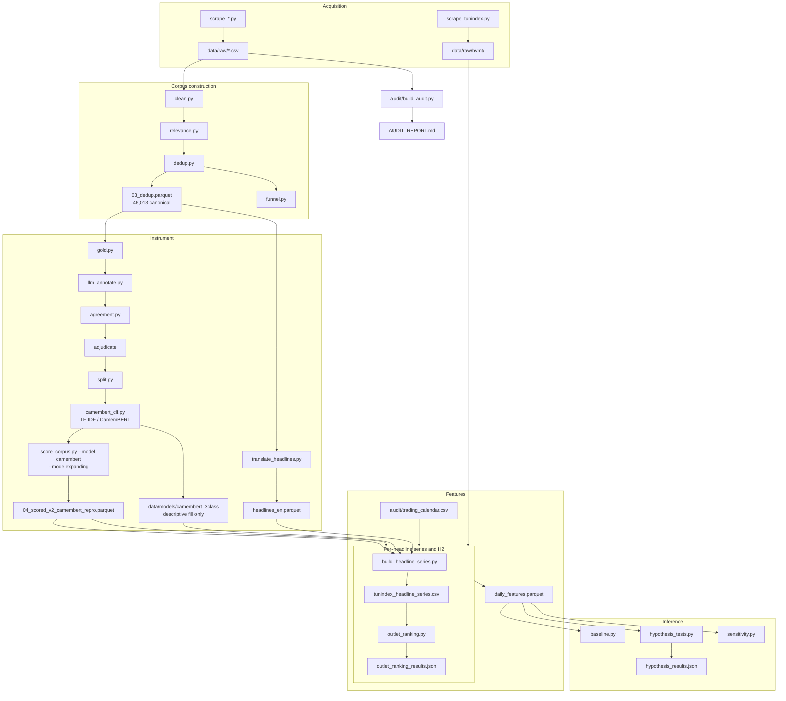

# Architecture

Full pipeline reference. For the short version read
[architecture-essentials.md](architecture-essentials.md) — that file holds the
constraints that break the science if violated, and nothing else.

---

## 1. Shape of the system

Five stages, each writing a durable artifact that the next stage reads. No stage
mutates its input. Everything under `data/` is DVC-tracked; nothing under `data/` is
ever hand-edited.



`audit/build_audit.py` is deliberately a **sibling**, not a stage. It reads
`data/raw/` directly so the evidence chain survives any change to the pipeline.

---

## 2. Stage 1 — Acquisition

Ten scrapers at repo root, one per outlet. Each writes a CSV to the current directory;
the file is then moved into `data/raw/` by hand and committed to DVC.

| Source | Scraper | Lang | Rows | In pipeline |
|---|---|---|---|---|
| ilboursa | `scrape_ilboursa.py` | fr | 26,596 | yes |
| kapitalis | `scrape_kapitalis.py` | fr | — | yes |
| leconomistmaghrebin | `leconomistemaghrebin_Scraper.py` | fr | — | yes |
| lapresse | `leconomistemaghrebin_Scraper.py` | fr | — | yes |
| tap | `scrape_tap.py` | fr | — | yes |
| economist_tunisia_all | `scrape_economist_tunisia.py` | en | — | yes |
| guardian_tunisia | `scrape_guardian.py` | en | — | yes |
| nyt_economy | `scrape_nyt_economy.py` | en | — | yes |
| economist_tunisia_economy | `scrape_economist_tunisia.py` | en | — | **no** — 100% subset of `_all` (§4 of audit) |
| assabah | `scrape_assabah.py` | ar | 56,292 | **no** — wrong country (§6b) |
| — | `scrape_jeuneafrique.py` | — | 0 | **no** — produces no raw file, orphan |

Membership is decided by one thing: presence of a key in `config.SOURCE_WINDOWS`.
Excluded sources keep their raw file, their scraper and their `io_raw.SOURCES` entry,
and appear in the funnel with `cleaned=0`. Exclusion is never deletion — the audit has
to stay reproducible against the evidence that justified it.

**Market data.** `scrape_tunindex.py` → `data/raw/bvmt/`, 4,167 sessions and 187,987
per-ticker OHLCV rows. Clean: no bad dates, no duplicate sessions, no `high < low`,
no close out of range, no nulls.

## 3. Stage 2 — Corpus construction

| Script | Reads | Writes | Does |
|---|---|---|---|
| `clean.py` | `data/raw/*.csv` via `io_raw.py` | `01_cleaned.parquet` | Character normalisation (`normalize.py`), per-source date window, boilerplate-title removal |
| `relevance.py` | `01_cleaned` | `02_relevant.parquet` | Keyword match → `tunisia_econ` / `global_linked` / `other`, with country negation (`relevance_geo.py`) and 79 BVMT issuer names |
| `dedup.py` | `02_relevant` | `03_dedup.parquet` | Template-key clustering; flags, never drops |
| `funnel.py` | all three + raw | `funnel.csv` | Per-source raw → cleaned → relevant → canonical counts |

**Normalisation is character-level only.** No stemming, no lemmatisation, no stopword
removal. Those belong to a later lexicon pass and would destroy the sentiment signal
the encoder needs.

**Relevance.** Both failure directions were found and fixed. False positives came from
bare generic terms (`inflation`, `taux directeur`) matching foreign stories — fixed by
country negation, wrong-country rate inside `tunisia_econ` 2.80% → 0.00%. False
positives were the smaller problem: **7,215 rows naming a listed BVMT issuer were being
discarded as `other`** ("Le bénéfice net de Land'Or bondit de 80%"). `KEYWORDS_ISSUERS`
now loads 79 issuer names from `sotcks_list.csv`. Short tickers (AB, BT, CC, SAH) are
excluded because they match inside ordinary words.

**Dedup** hashes a *template key*: digits and percentages → `#` with sign preserved,
French weekday and month names → `@`, punctuation folded. Deterministic, no similarity
threshold, no tuning. Token-sorting was built and rejected — of 100 extra merges, 2 were
semantic opposites (Fitch "négative à stable" vs "stable à négative"), so clause order
stays significant. Sign preservation means `-0,36%` never merges with `+0,21%`.

47,198 clusters → 46,013 canonical.

## 4. Stage 3 — The sentiment instrument

The scorer is an **instrument, not the contribution**. It must be deterministic and
reproducible; a zero-shot LLM call is neither.

**Gold set v2** (2,930 rows) — stratified by source × publication year, one row per
exact duplicate cluster, with the annotation pilot and the prompt's own worked examples
excluded so they cannot leak.

**Three annotators.** Agreement is what makes an LLM-labelled set defensible.

| Pair | n | Cohen quadratic |
|---|---|---|
| qwen2.5-7b vs ministral-8b | 1,930 | 0.597 moderate |
| qwen vs human | 150 | **0.689 substantial** |
| ministral vs human | 150 | 0.571 moderate |

Fleiss nominal 0.486. **Report the ordinal-weighted figure** — the gap between nominal
and quadratic is the finding: annotators disagree about *level*, agree about
*direction*.

Adjudication: 1,970 majority, 810 (27.6%) broken by qwen as tiebreaker, 150 human.
The tiebreak share is a disclosed weakness, not a detail.

**Prompt versioning.** `PROMPT_V1` is frozen byte-for-byte, with a test asserting it, so
the original 3,000 labels stay attributable. `PROMPT_V2` is the default and states the
question as expected market impact on Tunisian listed equities, makes `neutral` the
explicit default, defines all five labels by mechanism, and names the observed traps.
**v1 and v2 labels are not comparable and must never be pooled.**

**Split** — 2,339 train / 441 validation / 150 evaluation. The evaluation split *is*
the human-labelled subset, which is the point: the instrument is graded against humans,
not against other models. Fingerprinted by `id_sha256` in the split metadata.

**Model bake-off** (3-class, validation QWK):

| Model | QWK | Notes |
|---|---|---|
| TF-IDF + logistic | 0.561 | The bar. No new dependencies. |
| FinBERT zero-shot, raw FR | 0.021 | At chance. κ = 0.0005. |
| FinBERT zero-shot, translated | 0.503 | Translation is doing all the work |
| FinBERT + head, translated | 0.604 | |
| XLM-R fine-tuned | 0.589 | 108 min |
| **CamemBERT fine-tuned** | **0.708** | 4.9 min, 3 seeds, 5 epochs |

CamemBERT on the human evaluation split: QWK 0.635, accuracy 0.66 vs 0.567 floor.
A monolingual French encoder beats a multilingual one on a 97%-French corpus, and beats
a finance-domain English encoder even after translation.

**Reproduced 2026-09-30** by `preprocessing/camembert_clf.py` (AUDIT_REPORT §8i.1):
human-evaluation QWK **0.618** (per seed 0.544–0.617), accuracy 0.687, from the recipe in
the metadata. Learning rate, batch size and max length were never recorded; the chosen
values are written into every output. It is a scikit-learn-style `fit`/`predict`, so
`score_corpus.py --model camembert` reuses the expanding loop unchanged.

**CamemBERT cannot read English.** In 2019+ it scores Guardian 162/162, NYT 207/210 and
Economist 95/97 headlines `neutral` — it was trained on 52 English gold rows. Any
English-outlet sentiment from it is a constant.

**Scoring** — `score_corpus.py --model camembert --mode expanding` refits on gold rows
dated strictly before each year. 39,692 of 46,013 rows scored; 6,321 left **unscored**
because too few gold labels predate them. They are never imputed. `--mode static`
exists only to quantify the difference and must never produce a reported number.

**The yearly models before 2019 are under-trained.** The 2016 model saw 298 gold rows
and labels every headline `neutral`; 2017 (441) and 2018 (582) never predict
`negative`; 2019 (724) is the first with all three classes. Sentiment before 2019 is
not a measurement (AUDIT_REPORT §8i.2).

**The saved model** — `camembert_clf.py --save data/models/camembert_3class`, trained
on train + validation (2,780 rows) — is for scoring *new* headlines. Its
`--score-corpus` output (`04_scored_v2_camembert_static.parquet`) is a static fit that
saw 2026 labels; it only fills the pre-2019 rows of the headline series, tagged
`sent_source = saved_model`, and never enters a result.

**Translation** — `translate_headlines.py` runs `Helsinki-NLP/opus-mt-fr-en` pinned to
revision `c4aed37b`, the translator behind the committed gold translations, locally and
incrementally (the output is its own cache). It reproduces those translations on
2,835 of 2,857 rows and writes `headlines_en.parquet` (46,013 rows). A repair pass
retranslates looped or truncated outputs segment by segment and flags any it cannot fix
(`translation_suspect`). French decimal commas survive verbatim: "4,500 dinars" means
4.5.

## 5. Stage 4 — Features

`features.py` exists to enforce two rules, both tested:

1. **Returns are close-to-close.** `load_prices` drops `open` entirely.
2. **News dated D may only predict sessions strictly after D.** `map_to_next_session`
   uses `searchsorted(side="right")` against `audit/trading_calendar.csv`, not the next
   weekday — 191 weekdays in range are holidays.

Lags are counted **from the target**, not from the row. `ret_lag0` is the most recent
*available* return, known the moment session *i* closes. Guarded by
`test_features.py::test_most_recent_available_return_is_exposed_as_ret_lag0`.

Current feature set: `ret_lag0..2`, `vol_chg_lag0`, four day-of-week dummies, and per-arm
sentiment aggregates each paired with a `has_sent_*` indicator so "no headlines" stays
distinguishable from "neutral headlines".

## 6. Stage 5 — Inference

**Walk-forward, never cross-validation.** `min_train=500`, `refit_every=20`,
`EMBARGO_SESSIONS=5`, 2,678 predictions from 2014.

**For H1's binary target, regress the return and take the sign.** Do not classify up/down — logistic on a
drift-dominated binary label collapses to "always up" and predicts up 77–92% of the
time. Regression scores ~0.556 against ~0.545 on every feature set.

**Four arms**, because the placebo is necessary but not sufficient:

| Arm | Sentiment features |
|---|---|
| `all` | every headline |
| `ex_price` | price-report headlines removed |
| `placebo` | price-report headlines **only** — if this works, it is momentum |
| `orthogonal` | sentiment residualised on `ret_lag0`, `ret_lag1`, `log_headlines_lag0` |

**Two tests, both reported.** McNemar on signs is underpowered (MDE 3.2pp).
Diebold-Mariano on squared-error loss of returns with Newey-West HAC uses the magnitude
the sign test discards. Holm-Bonferroni across the four arms.

**Current result:** baseline AUC 0.6074. Every arm below it. DM significant-worse in
3 of 4 (p = 0.036–0.039); the orthogonal arm reaches p = 0.076. Block-bootstrap ΔAUC for
`all`: −0.0058, CI [−0.0123, +0.0001], p = 0.054. **H1 rejected** — with the caveat,
found after the fact, that ~28% of the 2,678 predictions fall in 2016–18, where the
sentiment instrument is degenerate (§4). H1 has not been rerun on 2019+.

**`kind="gbm"`** (added 2026-09-30) runs a shallow `HistGradientBoostingRegressor`
through the same walk-forward. On the 2019+ window it scores AUC 0.570 against the
linear model's 0.598: nothing nonlinear to find at this sample size.

**Per-outlet H2** — `outlet_ranking.py`, 2019+ and `yearly_refit` rows only, 1,426
predictions. Each outlet as daily mean score + `has_<outlet>`; three views: add-one vs
the price-only baseline (DM, Holm across outlets), leave-one-out from the all-outlets
model, and in-sample HAC-weighted OLS weights. Result: no outlet adds out of sample; the
all-outlets model scores 0.597 against 0.598; kapitalis degrades the forecast (Holm
p = 0.036, 0.10 without price reports). English outlets are untestable (§4).
**INCONCLUSIVE.** Full table in AUDIT_REPORT §8i.6.

**H3** — `h3.py`, pre-registered in `audit/PREREG_H3.md` (tag `prereg-h3-v1`). 3-class
direction at 1, 5 and 20 sessions with multinomial logistic, a logged exception to the
rule above (PREREG_H3 §7), plus a firm-drawdown panel. Phantom sessions are dropped via
`features.phantom_sessions()`. News adds nothing measurable: **INCONCLUSIVE**
(AUDIT_REPORT §H3).

**ADR-001 P0** (`bench.py`, AUDIT_REPORT §P0; G0 passed 2026-10-06) generalises `h3.walk_forward_proba` and `h3.compare` into the one
harness every later phase uses (regression and classification, in-fold transforms,
embargo max(5, h), circular block bootstrap, Clark-West for MSE targets), with
planted-signal and fake-signal controls and a seal on sessions from 2024-01-01.

## 7. Known structural defects

Ordered by how much they block publication.

1. **42 data artifacts have no producing script.** The v2 gold set, the fine-tuned
   CamemBERT and XLM-R, the FinBERT head, the translation step and the macro controls
   all exist as `data/curated/` outputs committed in `f00134c`, generated on a Windows
   machine, with no code in the repository. Nothing downstream of them is defensible
   until this is fixed.
   **Partly closed 2026-09-28:** five orphan columns in `daily_features.parquet`
   (`vol_chg_lag0`, `dow_next_{mon,tue,wed,thu}`) are now recomputed and verified by
   `build_timeseries.py` — see §8. Three remain orphaned: `sent_resid_lag1`,
   `sent_resid_ex_price_lag1` and `sent_resid_price_only_lag1` reproduce under no
   committed scored file (max abs diff 0.177 / 0.130 / 0.726).
   **Partly closed 2026-09-30:** the CamemBERT fine-tune (`camembert_clf.py`) and the
   translation step (`translate_headlines.py`) now have producing scripts; both match
   the committed outputs within seed noise, not bit-for-bit (AUDIT_REPORT §8i). Still
   orphaned: v2 gold-set construction, XLM-R, the FinBERT head, the macro controls, and
   the build of the committed `daily_features.parquet`.
2. **Sentiment before 2019 is not a measurement.** The yearly CamemBERT models for
   2016–18 saw 298–582 gold rows and collapse to one or two classes; ~28% of H1's
   predictions sit in those years. **Closed 2026-10-03 by gold v3** (AUDIT_REPORT §8j):
   v3 scores are usable from 2016. H1's rerun on v3 is ADR-001 P0.
   *(The former item 2 — no §8h — is closed.)*
3. **H1 provenance is unrecorded.** `hypothesis_results.json` does not say which scored
   file fed it, and `features.py:46` still defaults to `04_scored.parquet` (v1, dated
   2026-09-20) while the v2 and CamemBERT scores sit beside it unused by default.
   Established 2026-09-28 by column-wise comparison: the committed
   `daily_features.parquet` was built with `--scored 04_scored_v2_camembert.parquet`
   (3 differing columns, against 21 for v2-TF-IDF and 24 for the v1 default). Changing
   `DEFAULT_SCORED` is a one-line fix that would stop the next re-run being silently wrong.
4. **No dependency manifest.** No `requirements.txt`, no `pyproject.toml`. The install
   list in the README was reconstructed from imports. Since 2026-09-30 the pipeline also
   needs `torch`, `transformers` (4.57) and `sentencepiece`.
5. **Scrapers are scattered at repo root** with inconsistent naming
   (`leconomistemaghrebin_Scraper.py` against `scrape_*.py`). That file is also
   misnamed in substance: it scrapes **two** outlets, `leconomistmaghrebin` and
   `lapresse`. `scrape_jeuneafrique.py` is an orphan — it writes
   `jeuneafrique_headlines.csv`, which exists nowhere in `data/raw/`.
6. **`python` is not on PATH** in this environment; only `python3`. Every command in the
   README is wrong as written.
7. **Data defects found by the time-series EDA, none fixed** (AUDIT_REPORT §8i.7):
   19 phantom sessions that copy the previous row, 12 of them zero-volume holidays still
   in `trading_calendar.csv`; zero volume that is really missing data (2021-09,
   2026-04/05) feeding `vol_chg_lag0` on 73 sessions; **look-ahead in the orthogonal
   arm** — `features.py:127–135` fits its residual coefficients on the whole frame,
   test period included; `sent_resid_price_only_lag1` residualises 0-filled inputs;
   Brent returns repeated on filled sessions; U+FFFC left in 3 headlines by
   `normalize.py`.
   *Since 2026-10-03:* `features.phantom_sessions()` lists the phantom rows and `h3.py`
   drops them (PREREG_H3 §3.1). The orthogonal-arm look-ahead is still in `features.py`;
   ADR-001 P0 reruns H1 with that residual fitted in-fold.
8. **Stale price-report figures in code and docs.** Commit `7ed9c0c` replaced the v1
   regex with the v2 co-occurrence pattern and left the percentages behind. The true
   share under the current pattern is **3.74%** (1,722 of 46,013), not 10%.
   `config.py:136`, `README.md` and `AUDIT_REPORT.md` §8d still quote the v1 numbers;
   `architecture-essentials.md` and §8h are corrected.

## 8. The analysis time series — `tunindex_timeseries.csv`

Built by `preprocessing/build_timeseries.py`. **3,179 rows × 65 columns**, one row per
BVMT session, 2014-01-02 → 2026-09-16, `session` as `YYYY-MM-DD`. This is the frame to
analyse; `daily_features.parquet` remains the modelling frame that `hypothesis_tests.py`
consumes. The builder is additive — nothing in the pipeline reads its output.

It differs from `daily_features.parquet` in four ways:

1. **Adds `high` and `low`** (dropped by `features.load_prices`, which keeps only
   `range_pct`). `open` is still never read — rule 1.
2. **Adds the three macro series**, which no `.py` file in the repo referenced before.
3. **Adds `sent_mean_tfidf_lag1`**, the alternative scorer, as a robustness series.
4. **Drops 12 bit-identical duplicate columns.** `sent_mean` and `sent_mean_lag1` are the
   same numbers (`features.py:117`); the `_lag1` name is kept because that is what
   `hypothesis_tests.py` refers to. This is *not* a bug — see below.

### Data dictionary

| Group | Columns | Notes |
|---|---|---|
| Key | `session` | BVMT trading date, `YYYY-MM-DD` |
| Price level | `close`, `high`, `low`, `volume`, `log_volume` | raw bar; `open` excluded by rule 1 |
| Return | `ret`, `log_ret`, `abs_ret`, `range_pct` | `ret` is close-to-close, chained over the full 2010+ history so row 0 is a real value |
| **Target** | `ret_next` | `ret.shift(-1)`. Null on the final row only. Base rate 0.5422 up. The 19 zero-return sessions are **phantom rows** copying the previous close/high/low (12 zero-volume, mostly holidays), so `ret_next = 0` on the row before each is a fake target (AUDIT_REPORT §8i.7) |
| Price lags | `ret_lag0..3`, `abs_ret_lag0..3` | counted **from the target** (rule 3). `ret_lag0` is the most recent available return |
| Volume | `vol_chg_lag0` | `log(volume).diff().clip(±3)`, zeros masked to NaN **before** the diff, `fillna(0)`. 21 rows bind the clip |
| Calendar | `dow_next_mon/tue/wed/thu` | day-of-week of the *next* session; Friday is the dropped reference. Null on the final row |
| Counts | `n_headlines`, `n_sources`, `n_tunisia_econ`, `n_global_linked`, `n_price_reports`, `n_non_price`, `price_report_share`, `log_headlines`, `log_headlines_lag0..3` | median 13 headlines/session, max 57; every session has ≥1 |
| Sentiment — all | `sent_n`, `sent_mean_lag1`, `sent_pos_share_lag1`, `sent_neg_share_lag1`, `has_sent_lag1` | CamemBERT, −1/0/+1. `has_sent_lag1`=1 on 2,676 of 3,179 sessions |
| Sentiment — ex-price | same with `_ex_price` | price-report headlines removed |
| Sentiment — placebo | same with `_price_only` | price reports **only**; `has_sent_price_only_lag1`=1 on just 1,168 sessions, which is why the 0-fill + indicator convention is load-bearing |
| Sentiment — orthogonal | `sent_resid_lag1`, `sent_resid_ex_price_lag1`, `sent_resid_price_only_lag1` | residualised on `ret_lag0`, `ret_lag1`, `log_headlines_lag0`. **Not** duplicates |
| Sentiment — alternative | `sent_mean_tfidf_lag1`, `sent_n_tfidf_lag1` | TF-IDF v2. Null on 503 sessions (scoring starts 2016-01-01) |
| Macro | `brent_level/_ret/_is_ffill`, `stoxx50_level/_ret/_is_ffill`, `eur_tnd_level/_ret/_is_ffill` | see below |

### Two things to know before you model with it

**The `_lag1` suffix does not mean `.shift(1)` was applied — and must not be.** The
one-session lag is performed upstream by `map_to_next_session`'s `searchsorted(side="right")`:
every headline behind `sent_mean_lag1[i]` was published strictly before session *i*
opened, while the target `ret_next[i]` is session *i+1*. The suffix names the offset from
the **target**, per the lag convention in `features.py:180`. The empirical fingerprint
confirms it: `sent_mean_price_only_lag1` correlates **+0.227 with `ret_lag1`** (the
session before) and only **+0.039 with `ret_lag0`**. A leaking feature would show that
0.227 sitting in the `ret_lag0` column. Adding a `.shift(1)` would make every sentiment
feature two sessions stale, inject an uncarried NaN at row 0, and break the arm
alignment.

**Macro values on flagged sessions are stale, not observed.** Exact coverage before
forward-fill is Brent 97.48%, EuroStoxx 96.67%, EUR/TND 99.47% — 203 filled cells across
152 runs, longest 4 sessions. `*_is_ffill` marks every one (80 / 106 / 17). A derived
return on a filled session is 0.0 for EuroStoxx and EUR/TND but **not for Brent**: 76 of
its 80 filled rows carry a non-zero `brent_ret`, 74 repeating the previous session's
return. Exclude filled rows before using any macro return. Note `macro_controls.json` reports
`session_coverage: 1.0` for all three, which is coverage *after* filling. Also: Brent's
series ends 2026-09-15, so the final session is a fill, and EUR/TND ships 137 blank
publication days that are dropped before filling rather than treated as zeros.

### Nulls, in full

`ret_next` and the four `dow_next_*` on the last row (no next session);
`sent_mean_tfidf_lag1` / `sent_n_tfidf_lag1` on 503 sessions. **Nothing else is null.**
Unscored headlines are left unscored, never imputed — rule 6.

### What the builder fixed

`vol_chg_lag0` and the four `dow_next_*` were present in `daily_features.parquet` and
produced by **no committed script**: a fresh `features.py` run emits 59 columns against
the artifact's 64. They are recomputed here from the raw price file, and
`build_timeseries.verify()` asserts the recomputation matches the committed values
exactly — it does, on all 3,179 rows. Five orphan columns are now regenerable.

Three remain orphaned: `sent_resid_lag1`, `sent_resid_ex_price_lag1` and
`sent_resid_price_only_lag1` do not reproduce under any committed scored file (max abs
diff 0.177 / 0.130 / 0.726), so `daily_features.parquet` itself was still produced by a
build step outside this repository. That is §7 item 1, unchanged.

## 8b. The per-headline series — `tunindex_headline_series.csv`

Built by `preprocessing/build_headline_series.py` from `03_dedup.parquet`,
`headlines_en.parquet`, the CamemBERT scores and `tunindex_timeseries.csv`. **45,706 rows**,
one per canonical relevant headline, 3,179 sessions, 2014-01-02 → 2026-09-16. Long
format: a session with 12 headlines appears 12 times, each repeating its price values.

| Column | Notes |
|---|---|
| `session` | the session the headline is aligned to: first session **strictly after** `published_date` (rule 2) |
| `published_date` | publication day, `YYYY-MM-DD` |
| `row_id` | join key back to `03_dedup`, `headlines_en`, every scored file |
| `source` | outlet |
| `lang` | the headline's **original** language (per outlet: fr/en; no ar) |
| `headline` | **English** — French rows machine-translated (§4) |
| `sent_label`, `sent_score` | CamemBERT, `negative/neutral/positive`, −1/0/+1, scored on the **French** original |
| `sent_source` | `yearly_refit` (2019+, leakage-free, 30,858 rows) or `saved_model` (before 2019, **look-ahead**, 14,848 rows) |
| `sent_model_train_end` | for `yearly_refit` rows, the cutoff the scoring model was fitted before |
| `close`, `ret`, `ret_next` | the session's Tunindex values; `ret_next` null on the final session's 37 rows |

**Filter `sent_source == "yearly_refit"` for anything that claims prediction.**
`--fill-before none` rebuilds without the saved-model fill. Rows are headlines, not
sessions: never `.shift()` them.

## 9. Reference

```
.
├── README.md                      overview, results, how to reproduce
├── requirements.txt
├── docs/
│   ├── PRD.md                     what and why
│   └── architecture.md            this file
├── scrapers/                      acquisition (one script per outlet + Tunindex)
├── preprocessing/                 stages 2–5, H3 harness, tests
├── audit/                         evidence chain; AUDIT_REPORT.md is the paper's spine
├── colab/                         GPU notebook (CamemBERT training and yearly scoring)
├── data/                          DVC-tracked; never hand-edited
├── TsEDA.ipynb                    time-series EDA of the analysis frame (executed, outputs stored)
└── main.ipynb                     scratch: 3 cells reading a leftover Turkish CSV
```

`data/models/camembert_3class/` holds the saved CamemBERT (DVC). Run everything from the
repo root. Tests: `python3 -m pytest preprocessing` (121 pass).
